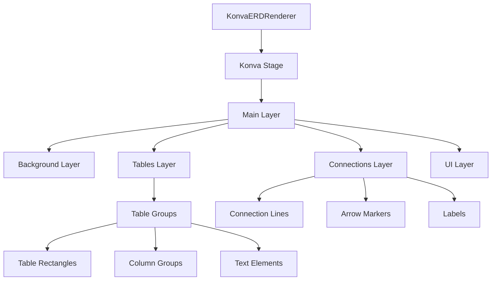
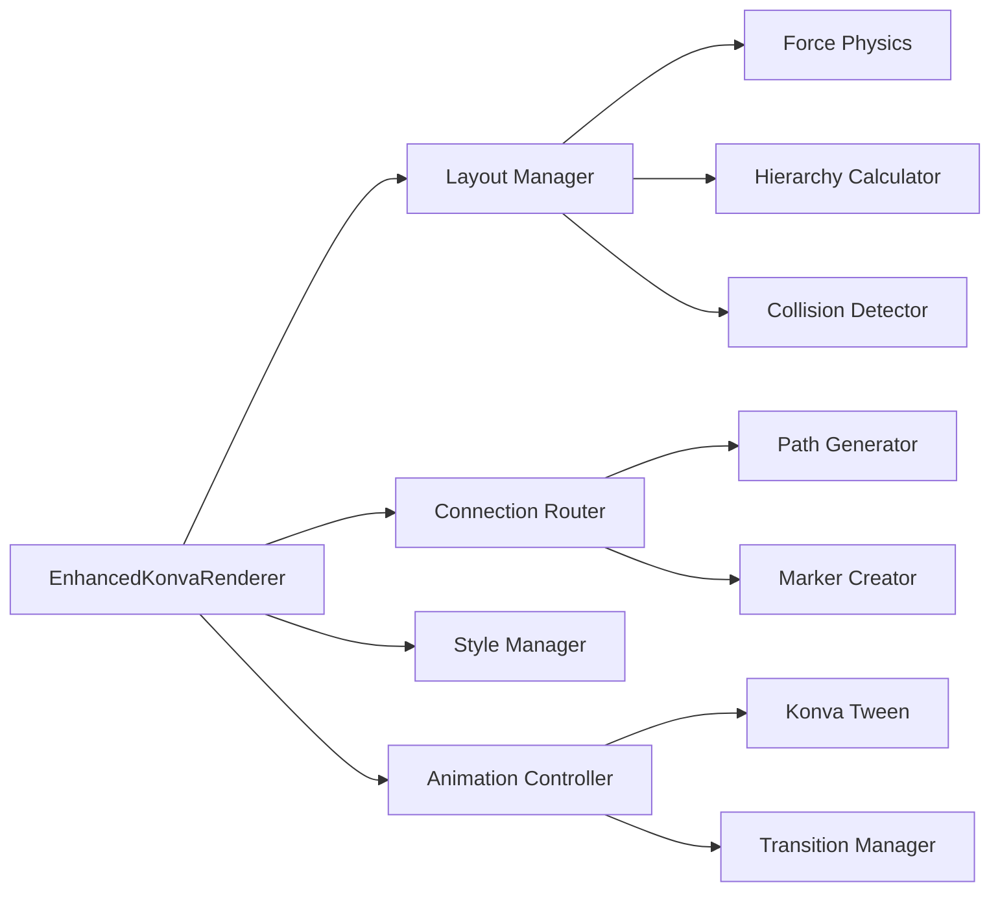
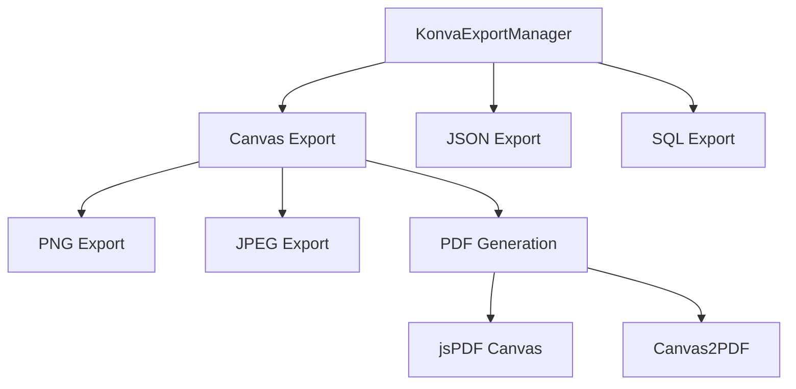
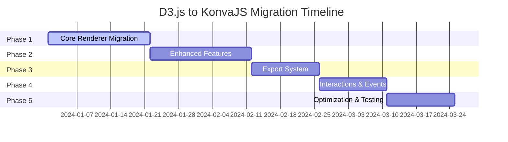

# D3.js to KonvaJS Migration Plan

## Executive Summary

This plan outlines the complete migration of the Interactive ERD Generator from D3.js (SVG-based) to KonvaJS (Canvas-based) while maintaining 100% feature parity. The migration will be executed through gradual, incremental phases to ensure application stability throughout the process.

## Current Architecture Analysis

### D3.js Components Identified
- **Primary Renderer**: [`ERDRenderer.js`](src/visualization/ERDRenderer.js:1) - Core SVG rendering with D3 selections, drag behaviors, zoom/pan
- **Enhanced Renderer**: [`EnhancedERDRenderer.js`](src/visualization/EnhancedERDRenderer.js:1) - Advanced layouts, intelligent routing, force-directed algorithms
- **Export System**: [`ExportManager.js`](src/export/ExportManager.js:1) - SVG/PDF export functionality using D3 selections
- **DOM Integration**: Direct SVG manipulation in HTML container [`index.html`](index.html:71)

### Key D3.js Features to Migrate
1. **SVG Element Creation & Manipulation** → Konva Shapes & Groups
2. **D3 Selections & Data Binding** → Konva Object Management
3. **Drag Behaviors** → Konva Drag Events
4. **Zoom/Pan Behaviors** → Konva Stage Transformations
5. **Transitions & Animations** → Konva Animations
6. **Event Handling** → Konva Event System
7. **Force-Directed Layouts** → Custom Physics with Konva
8. **SVG Export** → Canvas-to-Image Export

## Migration Strategy

### Phase 1: Foundation & Core Renderer Migration
**Branch**: `feature/konva-core-renderer`
**Duration**: 2-3 weeks
**Goal**: Replace [`ERDRenderer.js`](src/visualization/ERDRenderer.js:1) with KonvaJS equivalent

#### 1.1 Dependency Updates
```json
// package.json changes
{
  "dependencies": {
    "konva": "^9.2.0",
    "canvas": "^2.11.2", // For server-side rendering if needed
    // Remove: "d3": "^7.8.5"
  }
}
```

#### 1.2 Core Renderer Architecture


#### 1.3 Implementation Tasks
- [ ] Create `KonvaERDRenderer.js` class structure
- [ ] Replace SVG container with Konva Stage
- [ ] Convert table rendering from SVG `<g>` elements to Konva Groups
- [ ] Replace SVG `<rect>` and `<text>` with Konva Rect and Text shapes
- [ ] Implement Konva-based zoom/pan using Stage transformations
- [ ] Convert D3 drag behavior to Konva draggable properties
- [ ] Migrate event handling from D3 to Konva event system
- [ ] Preserve all visual styling and CSS class equivalents

### Phase 2: Enhanced Features Migration
**Branch**: `feature/konva-enhanced-renderer`
**Duration**: 2-3 weeks
**Goal**: Migrate [`EnhancedERDRenderer.js`](src/visualization/EnhancedERDRenderer.js:1) advanced features

#### 2.1 Layout Algorithms
- [ ] **Force-Directed Layout**: Convert D3 force simulation to custom physics
- [ ] **Hierarchical Layout**: Maintain topological sorting, update positioning
- [ ] **Circular Layout**: Preserve mathematical positioning
- [ ] **Grid Layout**: Simple conversion to Konva positioning

#### 2.2 Advanced Rendering Features
- [ ] **Intelligent Connection Routing**: Convert SVG path generation to Konva Line shapes
- [ ] **Overlap Prevention**: Adapt collision detection for Konva objects
- [ ] **Grid Overlay**: Replace SVG grid with Konva Line shapes
- [ ] **Enhanced Styling**: Convert CSS-based styling to Konva properties

#### 2.3 Implementation Architecture


### Phase 3: Export System Migration
**Branch**: `feature/konva-export-system`
**Duration**: 1-2 weeks
**Goal**: Replace SVG export with Canvas-based export system

#### 3.1 Export Architecture


#### 3.2 Implementation Tasks
- [ ] Replace [`ExportManager.js`](src/export/ExportManager.js:1) SVG export methods
- [ ] Implement `stage.toCanvas()` for high-resolution exports
- [ ] Integrate `jsPDF` with canvas data for PDF generation
- [ ] Maintain export dialog and options compatibility
- [ ] Preserve export quality and resolution settings
- [ ] Add PNG/JPEG export options (bonus from canvas capabilities)

### Phase 4: Interactions & Events Migration
**Branch**: `feature/konva-interactions`
**Duration**: 1-2 weeks
**Goal**: Migrate all interactive features and event handling

#### 4.1 Event System Mapping
| D3.js Event | Konva Equivalent | Implementation |
|-------------|------------------|----------------|
| `selection.on('click')` | `shape.on('click')` | Direct mapping |
| `selection.on('mouseenter')` | `shape.on('mouseenter')` | Direct mapping |
| `d3.drag()` | `draggable: true` | Konva built-in |
| `d3.zoom()` | Stage transforms | Custom implementation |
| `selection.call(drag)` | `group.draggable(true)` | Property setting |

#### 4.2 Implementation Tasks
- [ ] Convert table selection highlighting
- [ ] Migrate hover effects and tooltips
- [ ] Replace D3 drag behavior with Konva drag events
- [ ] Implement connection highlighting
- [ ] Convert property panel integration
- [ ] Maintain keyboard shortcuts functionality

### Phase 5: Performance Optimization & Testing
**Branch**: `feature/konva-optimization`
**Duration**: 1-2 weeks
**Goal**: Optimize performance and ensure feature parity

#### 5.1 Performance Enhancements
- [ ] Implement object pooling for tables/connections
- [ ] Add layer-based rendering optimization
- [ ] Implement viewport culling for large diagrams
- [ ] Optimize redraw cycles
- [ ] Add performance monitoring

#### 5.2 Testing & Validation
- [ ] Visual regression testing
- [ ] Performance benchmarking
- [ ] Export quality validation
- [ ] Cross-browser compatibility testing
- [ ] Accessibility feature preservation

## Technical Implementation Details

### 1. Core Renderer Conversion

#### Current D3.js Structure
```javascript
// ERDRenderer.js - Current D3 implementation
this.svg = d3.select(this.container)
    .append('svg')
    .attr('width', '100%')
    .attr('height', '100%');

this.mainGroup = this.svg.append('g')
    .attr('class', 'main-group');
```

#### New Konva Structure
```javascript
// KonvaERDRenderer.js - New implementation
this.stage = new Konva.Stage({
    container: this.container,
    width: this.options.width,
    height: this.options.height
});

this.mainLayer = new Konva.Layer();
this.connectionsLayer = new Konva.Layer();
this.tablesLayer = new Konva.Layer();

this.stage.add(this.connectionsLayer);
this.stage.add(this.tablesLayer);
this.stage.add(this.mainLayer);
```

### 2. Table Rendering Migration

#### D3.js Table Rendering
```javascript
const tableGroups = this.tablesGroup
    .selectAll('.table-group')
    .data(tables, d => d.name)
    .enter()
    .append('g')
    .attr('class', 'table-group')
    .attr('transform', d => `translate(${pos.x}, ${pos.y})`);
```

#### Konva Table Rendering
```javascript
const tableGroup = new Konva.Group({
    x: pos.x,
    y: pos.y,
    draggable: true,
    name: 'table-group'
});

const tableRect = new Konva.Rect({
    width: tableSize.width,
    height: tableSize.height,
    fill: '#ffffff',
    stroke: '#e2e8f0',
    strokeWidth: 1,
    cornerRadius: 4
});

tableGroup.add(tableRect);
this.tablesLayer.add(tableGroup);
```

### 3. Connection Rendering

#### D3.js Connection Paths
```javascript
connectionGroup.append('path')
    .attr('class', 'connection-line')
    .attr('d', pathData)
    .attr('stroke', '#64748b')
    .attr('stroke-width', 2);
```

#### Konva Connection Lines
```javascript
const connectionLine = new Konva.Line({
    points: [x1, y1, x2, y2],
    stroke: '#64748b',
    strokeWidth: 2,
    lineCap: 'round',
    lineJoin: 'round'
});

this.connectionsLayer.add(connectionLine);
```

### 4. Event Handling Migration

#### D3.js Events
```javascript
tableGroups.on('click', (event, d) => {
    this.onTableClick(event, d);
});
```

#### Konva Events
```javascript
tableGroup.on('click', (e) => {
    this.onTableClick(e, tableData);
});
```

### 5. Export System Implementation

#### Canvas Export
```javascript
// High-resolution canvas export
const dataURL = this.stage.toDataURL({
    mimeType: 'image/png',
    quality: 1.0,
    pixelRatio: 2 // For high-resolution export
});

// PDF generation
const pdf = new jsPDF();
const canvas = this.stage.toCanvas();
pdf.addImage(canvas.toDataURL(), 'PNG', 0, 0, 210, 297);
pdf.save('erd-diagram.pdf');
```

## Migration Timeline



**Total Estimated Duration**: 10-12 weeks

## Risk Mitigation

### Technical Risks
1. **Performance Degradation**: Canvas rendering may be slower than SVG for complex diagrams
   - *Mitigation*: Implement layer-based rendering and viewport culling
2. **Export Quality Loss**: Canvas exports may have different quality characteristics
   - *Mitigation*: Implement high-resolution rendering and quality testing
3. **Event Handling Complexity**: Konva event system differences from D3
   - *Mitigation*: Create abstraction layer for consistent event handling

### Project Risks
1. **Feature Regression**: Risk of losing functionality during migration
   - *Mitigation*: Comprehensive testing suite and gradual rollout
2. **Timeline Overruns**: Complex migration may take longer than estimated
   - *Mitigation*: Phased approach allows for timeline adjustments

## Success Criteria

### Functional Requirements
- [ ] All tables render correctly with proper styling
- [ ] All relationships display with correct routing
- [ ] Drag-and-drop functionality works identically
- [ ] Zoom/pan behavior matches current implementation
- [ ] All layout algorithms produce identical results
- [ ] Export functionality maintains quality and formats
- [ ] Performance equals or exceeds current implementation

### Technical Requirements
- [ ] No breaking changes to public APIs
- [ ] Maintains current CSS theming system
- [ ] Preserves accessibility features
- [ ] Cross-browser compatibility maintained
- [ ] Bundle size impact minimized

## Post-Migration Benefits

1. **Performance Improvements**: Canvas rendering optimizations for large diagrams
2. **Enhanced Export Options**: Native PNG/JPEG export capabilities
3. **Better Mobile Support**: Improved touch interactions
4. **Animation Capabilities**: Smoother transitions and effects
5. **Memory Efficiency**: Better garbage collection with object pooling

## Implementation Checklist

### Phase 1: Core Renderer
- [ ] Install Konva dependency
- [ ] Create `src/visualization/KonvaERDRenderer.js`
- [ ] Implement basic stage and layer setup
- [ ] Convert table rendering to Konva shapes
- [ ] Implement basic drag functionality
- [ ] Add zoom/pan controls
- [ ] Test basic rendering functionality

### Phase 2: Enhanced Features
- [ ] Create `src/visualization/EnhancedKonvaRenderer.js`
- [ ] Implement force-directed layout algorithm
- [ ] Add intelligent connection routing
- [ ] Implement grid overlay system
- [ ] Add advanced styling capabilities
- [ ] Test layout algorithms

### Phase 3: Export System
- [ ] Create `src/export/KonvaExportManager.js`
- [ ] Implement canvas-to-PNG export
- [ ] Add PDF generation with jsPDF
- [ ] Maintain JSON/SQL export functionality
- [ ] Test export quality and formats

### Phase 4: Interactions
- [ ] Migrate all event handlers
- [ ] Implement hover effects
- [ ] Add selection highlighting
- [ ] Test all interactive features
- [ ] Verify keyboard shortcuts

### Phase 5: Optimization
- [ ] Implement object pooling
- [ ] Add performance monitoring
- [ ] Optimize rendering cycles
- [ ] Run performance benchmarks
- [ ] Complete testing suite

This comprehensive migration plan provides a roadmap for converting the ERD Generator from D3.js to KonvaJS while maintaining complete feature parity and ensuring optimal performance.