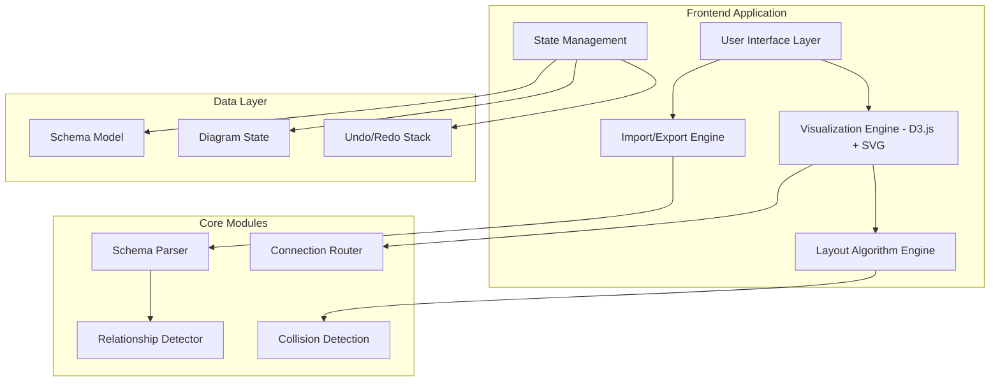
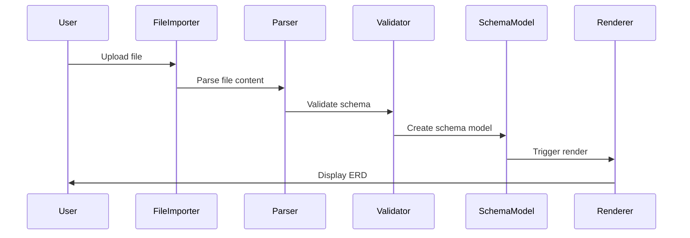
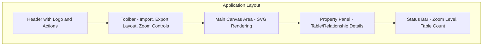

# Interactive ERD Generator - Comprehensive Development Plan

## 1. Project Architecture Overview



## 2. Technology Stack Selection

### Core Technologies
- **Frontend**: HTML5, CSS3, Modern JavaScript (ES2022+)
- **Visualization**: D3.js v7 with SVG rendering
- **Build Tool**: Vite for development and bundling
- **Styling**: CSS Custom Properties with modern CSS features
- **File Processing**: Native File API with custom parsers

### Key Libraries
- **D3.js**: Data visualization and DOM manipulation
- **jsPDF**: PDF export functionality
- **SQL Parser**: Custom lightweight SQL DDL parser
- **File-saver**: Client-side file downloads

### Technology Analysis Summary

Based on comprehensive analysis, **D3.js with SVG rendering** was selected for:

1. **Connection Routing**: D3.js excels at path generation and manipulation, crucial for orthogonal routing requirements
2. **Data Binding**: Perfect for dynamic ERD updates when tables are moved
3. **Scalability**: Handles large datasets efficiently with virtual rendering
4. **Export Functionality**: SVG is easily exportable to PNG, SVG, or PDF
5. **Accessibility**: SVG content is more accessible than Canvas
6. **Mature Ecosystem**: Extensive examples for similar diagram applications

## 3. File Format Support Specifications

### 3.1 JSON Schema Format
```json
{
  "schema": {
    "name": "database_name",
    "tables": [
      {
        "name": "users",
        "columns": [
          {
            "name": "id",
            "type": "INT",
            "constraints": ["PRIMARY KEY", "AUTO_INCREMENT"]
          },
          {
            "name": "email",
            "type": "VARCHAR(255)",
            "constraints": ["UNIQUE", "NOT NULL"]
          }
        ],
        "relationships": [
          {
            "type": "one-to-many",
            "target_table": "posts",
            "source_column": "id",
            "target_column": "user_id"
          }
        ]
      }
    ]
  }
}
```

### 3.2 SQL DDL Support
- Parse CREATE TABLE statements
- Extract column definitions and constraints
- Identify PRIMARY KEY and FOREIGN KEY relationships
- Support for common SQL dialects (MySQL, PostgreSQL, SQLite)

### 3.3 Plain Text Format
```
TABLE users
  id INT PRIMARY KEY AUTO_INCREMENT
  username VARCHAR(50) UNIQUE NOT NULL
  email VARCHAR(255) UNIQUE NOT NULL
  created_at TIMESTAMP DEFAULT CURRENT_TIMESTAMP

TABLE posts
  id INT PRIMARY KEY AUTO_INCREMENT
  user_id INT FOREIGN KEY REFERENCES users(id)
  title VARCHAR(255) NOT NULL
  content TEXT
  created_at TIMESTAMP DEFAULT CURRENT_TIMESTAMP
```

## 4. Application Architecture

### 4.1 Project Structure
```
erd-generator/
├── src/
│   ├── core/
│   │   ├── SchemaModel.js
│   │   ├── DiagramState.js
│   │   └── EventBus.js
│   ├── parsers/
│   │   ├── JsonParser.js
│   │   ├── SqlParser.js
│   │   └── TextParser.js
│   ├── visualization/
│   │   ├── ERDRenderer.js
│   │   ├── TableRenderer.js
│   │   ├── ConnectionRenderer.js
│   │   └── InteractionHandler.js
│   ├── algorithms/
│   │   ├── LayoutAlgorithm.js
│   │   ├── ConnectionRouter.js
│   │   ├── CollisionDetector.js
│   │   └── RelationshipDetector.js
│   ├── export/
│   │   ├── SvgExporter.js
│   │   ├── PdfExporter.js
│   │   └── SchemaExporter.js
│   ├── ui/
│   │   ├── FileImporter.js
│   │   ├── ToolPanel.js
│   │   ├── PropertyPanel.js
│   │   └── ExportDialog.js
│   └── utils/
│       ├── GeometryUtils.js
│       ├── ColorUtils.js
│       └── ValidationUtils.js
├── assets/
│   ├── styles/
│   │   ├── main.css
│   │   ├── components.css
│   │   └── themes.css
│   └── icons/
├── tests/
├── docs/
├── index.html
├── main.js
├── package.json
└── vite.config.js
```

### 4.2 Core Components Design

#### 4.2.1 Schema Model
```javascript
class SchemaModel {
  constructor() {
    this.tables = new Map();
    this.relationships = new Set();
    this.metadata = {};
  }
  
  addTable(tableDefinition) { /* ... */ }
  removeTable(tableName) { /* ... */ }
  addRelationship(relationship) { /* ... */ }
  detectRelationships() { /* ... */ }
  validate() { /* ... */ }
}
```

#### 4.2.2 ERD Renderer (D3.js)
```javascript
class ERDRenderer {
  constructor(container, options = {}) {
    this.svg = d3.select(container).append('svg');
    this.zoomBehavior = d3.zoom();
    this.dragBehavior = d3.drag();
    this.setupZoomAndPan();
  }
  
  render(schema, layout) { /* ... */ }
  updateConnections() { /* ... */ }
  handleTableDrag() { /* ... */ }
  setupInteractions() { /* ... */ }
}
```

## 5. Core Feature Implementation Plan

### 5.1 Import System


### 5.2 Relationship Detection Algorithm
```javascript
class RelationshipDetector {
  detectRelationships(tables) {
    const relationships = [];
    
    // 1. Explicit foreign key detection
    relationships.push(...this.detectExplicitForeignKeys(tables));
    
    // 2. Name-based detection (id, user_id, etc.)
    relationships.push(...this.detectByNaming(tables));
    
    // 3. Type-based detection
    relationships.push(...this.detectByTypes(tables));
    
    return this.deduplicateRelationships(relationships);
  }
}
```

### 5.3 Connection Routing System
```javascript
class ConnectionRouter {
  routeConnection(sourceTable, targetTable, sourceColumn, targetColumn) {
    // 1. Calculate optimal connection points
    const sourcePoint = this.getConnectionPoint(sourceTable, sourceColumn);
    const targetPoint = this.getConnectionPoint(targetTable, targetColumn);
    
    // 2. Generate orthogonal path
    const path = this.generateOrthogonalPath(sourcePoint, targetPoint);
    
    // 3. Avoid table collisions
    const optimizedPath = this.avoidCollisions(path, this.getAllTables());
    
    // 4. Apply connection offset
    return this.applyConnectionOffset(optimizedPath);
  }
}
```

### 5.4 Auto-Layout Algorithm
```javascript
class LayoutAlgorithm {
  calculateLayout(schema) {
    // 1. Force-directed layout for initial positioning
    const initialLayout = this.forceDirectedLayout(schema);
    
    // 2. Grid alignment for clean appearance
    const gridLayout = this.alignToGrid(initialLayout);
    
    // 3. Minimize connection crossings
    const optimizedLayout = this.minimizeCrossings(gridLayout);
    
    // 4. Compact layout to reduce whitespace
    return this.compactLayout(optimizedLayout);
  }
}
```

## 6. User Interface Design

### 6.1 Main Application Layout


### 6.2 Interactive Features
- **Hover Effects**: Highlight connected tables and relationships
- **Selection System**: Click to select tables/relationships
- **Context Menus**: Right-click for additional actions
- **Tooltips**: Show detailed information on hover
- **Keyboard Shortcuts**: Common actions (Ctrl+Z, Ctrl+Y, Delete)

### 6.3 Visual Design Requirements
- **Table Representation**: Clear column names and data types
- **Key Distinction**: Visual difference between primary keys, foreign keys, and regular columns
- **Modern UI**: Clean, intuitive controls with responsive design
- **Color Coding**: Consistent color scheme for different element types

## 7. Export System Architecture

### 7.1 Export Formats
```javascript
class ExportManager {
  exportSVG(diagram, options) {
    // Generate clean SVG with embedded styles
    return this.generateCleanSVG(diagram, options);
  }
  
  exportPDF(diagram, options) {
    // Convert SVG to PDF with proper scaling
    return this.svgToPdf(diagram, options);
  }
  
  exportSchema(schema, format) {
    // Export back to JSON, SQL DDL, or text format
    switch(format) {
      case 'json': return this.toJsonSchema(schema);
      case 'sql': return this.toSqlDDL(schema);
      case 'text': return this.toTextFormat(schema);
    }
  }
}
```

### 7.2 Export Requirements
- **SVG Format**: Vector graphics for web sharing and scaling
- **PDF Format**: Professional documentation and printing support
- **Schema Export**: Ability to export back to original import formats (JSON, SQL DDL)
- **High Resolution**: Support for high-DPI displays and print quality

## 8. Performance Optimization Strategy

### 8.1 Large Schema Handling (50+ Tables)
- **Virtual Rendering**: Only render visible tables
- **Connection Culling**: Hide connections outside viewport
- **Lazy Loading**: Load table details on demand
- **Memory Management**: Efficient cleanup of DOM elements

### 8.2 Rendering Optimizations
- **Canvas Fallback**: Switch to Canvas for very large diagrams
- **Batch Updates**: Group DOM modifications
- **Debounced Events**: Throttle drag and zoom events
- **Web Workers**: Offload layout calculations

### 8.3 Connection Routing Optimizations
- **Collision Detection**: Efficient collision detection algorithms
- **Path Caching**: Cache calculated paths for performance
- **Incremental Updates**: Only recalculate affected connections
- **Spatial Indexing**: Use spatial data structures for large diagrams

## 9. Development Phases

### Phase 1: Core Foundation (Week 1-2)
- Project setup with Vite
- Basic HTML/CSS structure
- D3.js integration and SVG setup
- File import system (JSON only)
- Basic table rendering

**Deliverables:**
- Working project structure
- Basic file import functionality
- Simple table visualization
- Zoom and pan basic implementation

### Phase 2: Visualization Engine (Week 3-4)
- Table drag-and-drop functionality
- Basic connection rendering
- Zoom and pan implementation
- Simple layout algorithm

**Deliverables:**
- Interactive table positioning
- Basic relationship visualization
- Smooth zoom and pan experience
- Grid-based layout system

### Phase 3: Advanced Features (Week 5-6)
- SQL DDL and text format parsers
- Relationship detection algorithms
- Advanced connection routing
- Interactive features (hover, tooltips)

**Deliverables:**
- Multi-format import support
- Intelligent relationship detection
- Orthogonal connection routing
- Rich interactive features

### Phase 4: Export & Polish (Week 7-8)
- SVG and PDF export
- Schema export functionality
- UI/UX improvements
- Performance optimizations
- Testing and bug fixes

**Deliverables:**
- Complete export functionality
- Polished user interface
- Performance optimizations
- Comprehensive testing suite

## 10. Testing Strategy

### 10.1 Unit Tests
- Parser functionality for all formats
- Layout algorithm correctness
- Connection routing accuracy
- Export format validation

### 10.2 Integration Tests
- End-to-end import/export workflows
- Complex schema handling
- Performance benchmarks
- Cross-browser compatibility

### 10.3 User Acceptance Tests
- Drag-and-drop functionality
- Large schema performance
- Export quality verification
- Accessibility compliance

### 10.4 Performance Testing
- Large schema rendering (50+ tables)
- Memory usage monitoring
- Connection routing efficiency
- Export generation speed

## 11. Technical Requirements Summary

### 11.1 Core Functionality Checklist
- ✅ Import table definitions from JSON, SQL DDL, and text files
- ✅ Automatically generate ERD visualization
- ✅ Manual table repositioning with drag-and-drop
- ✅ Intelligent auto-layout algorithm
- ✅ Auto-detect relationships by column name matching
- ✅ Manual relationship creation and editing
- ✅ Support for one-to-one, one-to-many, and many-to-many relationships

### 11.2 Connection Routing Checklist
- ✅ Horizontal and vertical lines only (no diagonal connections)
- ✅ Route connections around tables without overlapping
- ✅ Connection offset system to prevent line overlap
- ✅ Connections originate from specific columns

### 11.3 Interactive Features Checklist
- ✅ Hover effects highlighting connected tables and relationships
- ✅ Tooltip display with relationship details
- ✅ Real-time connection updates during table repositioning
- ✅ Zoom and pan capabilities
- ✅ Undo/redo functionality

### 11.4 Technical Implementation Checklist
- ✅ SVG rendering for smooth performance
- ✅ Efficient collision detection for connection routing
- ✅ Schema validation for imported files
- ✅ Optimization for handling 50+ tables
- ✅ Export functionality (SVG, PDF, schema formats)

## 12. Risk Assessment and Mitigation

### 12.1 Technical Risks
**Risk**: Complex connection routing algorithm performance
**Mitigation**: Implement spatial indexing and incremental updates

**Risk**: Large schema rendering performance
**Mitigation**: Virtual rendering and canvas fallback options

**Risk**: Cross-browser compatibility issues
**Mitigation**: Comprehensive testing and polyfills

### 12.2 Development Risks
**Risk**: D3.js learning curve impacting timeline
**Mitigation**: Allocate extra time for D3.js familiarization and prototyping

**Risk**: Complex layout algorithm implementation
**Mitigation**: Start with simple algorithms and iterate to more sophisticated ones

## 13. Future Enhancement Opportunities

### 13.1 Advanced Features
- **Database Connectivity**: Direct connection to live databases
- **Collaborative Editing**: Real-time collaboration features
- **Version Control**: Schema versioning and change tracking
- **Advanced Export**: PowerPoint, Visio format support

### 13.2 AI Integration
- **Smart Layout**: AI-powered optimal table positioning
- **Relationship Suggestions**: ML-based relationship detection
- **Schema Analysis**: Automated schema quality assessment

This comprehensive plan provides a solid foundation for building a professional-grade ERD generator that meets all specified requirements. The modular architecture ensures maintainability, while the phased approach allows for iterative development and testing.